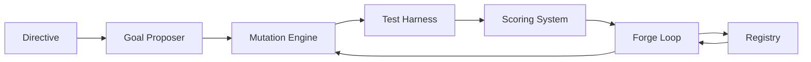

# Hephaestus Components

## Overview

Hephaestus is designed with a modular architecture comprising several specialized components. Each component fulfills a specific role in the code generation, testing, and improvement process, working together to create a powerful and flexible system.

This overview provides a high-level introduction to each component and how they interact. For detailed information about a specific component, follow the links to the dedicated documentation pages.

## Core Components

  

    

      <h3><a href="goal_proposer/">Goal Proposer</a></h3>
    

    

      
Analyzes project requirements to identify specific goals for code improvement, prioritizing tasks based on project needs and constraints.

      
<a href="goal_proposer/" class="btn btn-primary">Learn More</a>

    

  

  
  

    

      <h3><a href="mutation/">Mutation Engine</a></h3>
    

    

      
Generates and transforms code based on directives and goals, applying various mutation strategies to create improved implementations.

      
<a href="mutation/" class="btn btn-primary">Learn More</a>

    

  

  

    

      <h3><a href="test_harness/">Test Harness</a></h3>
    

    

      
Evaluates code implementations against tests and requirements, providing feedback on functionality, correctness, and quality.

      
<a href="test_harness/" class="btn btn-primary">Learn More</a>

    

  

  

    

      <h3><a href="scoring/">Scoring System</a></h3>
    

    

      
Assesses code quality across multiple dimensions, providing objective metrics to guide selection and improvement of implementations.

      
<a href="scoring/" class="btn btn-primary">Learn More</a>

    

  

  

    

      <h3><a href="forge_loop/">Forge Loop</a></h3>
    

    

      
Orchestrates the iterative improvement process, managing the workflow between components and controlling the improvement cycle.

      
<a href="forge_loop/" class="btn btn-primary">Learn More</a>

    

  

  

    

      <h3><a href="registry/">Registry</a></h3>
    

    

      
Provides centralized storage and versioning for code implementations, quality metrics, and execution outcomes throughout the improvement process.

      
<a href="registry/" class="btn btn-primary">Learn More</a>

    

  

## Component Interaction

The components interact in a feedback loop, as illustrated in the diagram below:

1. The **Goal Proposer** analyzes directives and requirements to identify specific improvement targets.
2. The **Mutation Engine** generates or modifies code based on these goals.
3. The **Test Harness** evaluates the implementation against tests and requirements.
4. The **Scoring System** assesses the quality of the implementation.
5. The **Forge Loop** decides whether to continue improvement or accept the current implementation.
6. The **Registry** stores all versions and their metadata throughout the process.

## Supporting Components

In addition to the core components, Hephaestus includes several supporting components that enhance its functionality:

  

    

      <h3><a href="directive_format/">Directive Format</a></h3>
    

    

      
Standardized specification for communicating intent and requirements to Hephaestus, ensuring clear instruction interpretation.

      
<a href="directive_format/" class="btn btn-primary">Learn More</a>

    

  

  

    

      <h3><a href="test_debug_protocol/">Test Debug Protocol</a></h3>
    

    

      
Structured methodology for diagnosing, reporting, and resolving test failures, enabling more efficient debugging.

      
<a href="test_debug_protocol/" class="btn btn-primary">Learn More</a>

    

  

## Configuration

Each component can be configured independently through a unified configuration system. This allows for fine-tuning of the system's behavior to meet specific project requirements. Common configuration options include:

- Enabling/disabling specific components
- Setting resource limits and timeouts
- Configuring component-specific parameters
- Defining integration points with external systems

For a complete reference of configuration options, see the [Configuration Guide](../reference/configuration.md).

## Extending Hephaestus

Hephaestus is designed to be extensible, allowing for the addition of new components or the replacement of existing ones. This modular architecture enables customization for specific domains or requirements.

To learn more about extending Hephaestus with custom components, see the [Extension Guide](../development/extending.md).

## Component Dependencies

While each component serves a distinct purpose, they have dependencies on one another:

| Component | Dependencies |
|-----------|--------------|
| Goal Proposer | Registry (for historical context) |
| Mutation Engine | Goal Proposer, Registry |
| Test Harness | Registry |
| Scoring System | Test Harness, Registry |
| Forge Loop | All other components |
| Registry | None (fundamental infrastructure) |

## Summary

The component-based architecture of Hephaestus provides several advantages:

- **Modularity**: Components can be developed, tested, and maintained independently
- **Flexibility**: Different components can be swapped or modified to adapt to specific needs
- **Scalability**: Components can be distributed across multiple machines for improved performance
- **Extensibility**: New components can be added to extend the system's capabilities

By understanding how these components work together, you can effectively leverage Hephaestus for your code generation and improvement needs.

