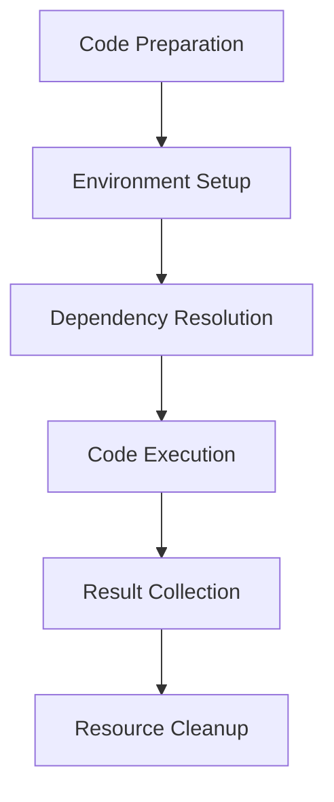

# Execution Model

## Overview

The Execution Model in Hephaestus defines how code is executed, resources are managed, and security is enforced throughout the system. It provides a controlled environment for running both generated code and test suites, ensuring reliability and safety.

This model underpins all components that need to execute code, particularly the Test Harness and evaluation mechanisms in the improvement cycle.

## Execution Components

### Runtime Environment

The Runtime Environment provides the infrastructure for executing code:

1. **Isolation**: Code runs in containerized or sandboxed environments to prevent system access
2. **Resource Control**: Memory, CPU, and time limits prevent resource exhaustion
3. **Dependency Management**: Required libraries and tools are provisioned as needed
4. **State Management**: Execution state is tracked and persisted when necessary
5. **Instrumentation**: Runtime metrics are collected for performance analysis

### Execution Pipeline

Code execution follows a well-defined pipeline:



1. **Code Preparation**: Source code is prepared for execution, including formatting and preliminary validation
2. **Environment Setup**: The execution environment is configured according to requirements
3. **Dependency Resolution**: Required dependencies are installed or made available
4. **Code Execution**: The actual code is executed with appropriate inputs
5. **Result Collection**: Outputs, errors, and performance metrics are captured
6. **Resource Cleanup**: Resources are freed and the environment is reset

## Execution Modes

Hephaestus supports multiple execution modes to accommodate different use cases:

### Direct Execution

Code is executed directly within the current process or in a child process. This mode offers:

- **Low Overhead**: Minimal performance impact
- **Simple Setup**: No complex infrastructure required
- **Direct Access**: Immediate access to results

However, it provides limited isolation and is primarily used for trusted code or testing in development environments.

### Sandboxed Execution

Code runs in a restricted environment with limited permissions:

- **Enhanced Security**: Restricted access to system resources
- **Controlled I/O**: Managed access to files and network
- **Resource Limits**: Enforced constraints on memory and CPU usage

This mode balances security and performance for most production scenarios.

### Containerized Execution

Code executes within containerized environments (e.g., Docker):

- **Complete Isolation**: Full separation from the host system
- **Environment Consistency**: Identical execution environment across runs
- **Dependency Isolation**: No conflicts with host system libraries

This mode offers the highest level of isolation but requires container infrastructure.

## Resource Management

### Resource Limits

The execution model enforces configurable limits on:

| Resource | Default Limit | Configuration Parameter |
|----------|---------------|-------------------------|
| Memory | 256 MB | `execution.resource_limits.memory_mb` |
| CPU Time | 30 seconds | `execution.resource_limits.cpu_time_seconds` |
| Wall Clock Time | 60 seconds | `execution.resource_limits.timeout_seconds` |
| Disk Space | 100 MB | `execution.resource_limits.disk_mb` |
| Network Access | Disabled | `execution.resource_limits.network_enabled` |

### Graceful Degradation

When resource limits are approached, the system employs graceful degradation strategies:

1. **Warning Notifications**: Issues warnings before forceful termination
2. **Result Preservation**: Attempts to save partial results before shutdown
3. **Graduated Limits**: Progressively restricts resources instead of immediate termination
4. **Fallback Mechanisms**: Switches to alternative execution paths when primary paths fail

## Security Model

### Multi-Layer Security

The execution model implements a defense-in-depth approach with multiple security layers:

1. **Code Validation**: Static analysis to identify potentially harmful code
2. **Permission Restrictions**: Limited access rights for executed code
3. **Resource Isolation**: Containment of execution environments
4. **Resource Limits**: Prevention of denial-of-service through resource constraints
5. **Monitoring**: Runtime detection of suspicious behavior

### Code Validation

Before execution, code undergoes validation checks:

- **Syntax Validation**: Ensures code is syntactically correct
- **Static Analysis**: Identifies potentially harmful operations
- **Dependency Scanning**: Checks for vulnerable dependencies
- **Pattern Matching**: Detects known malicious patterns

### Allowed Operations

The execution model explicitly defines permitted operations:

| Operation Category | Default Permission | Configuration Parameter |
|-------------------|-------------------|-------------------------|
| File System Read | Limited | `execution.permissions.file_read` |
| File System Write | Limited | `execution.permissions.file_write` |
| Network Access | Disabled | `execution.permissions.network` |
| Process Creation | Disabled | `execution.permissions.process_creation` |
| System Calls | Limited | `execution.permissions.system_calls` |

## Configuration

The execution model is highly configurable through the primary configuration file:

```yaml
execution:
  mode: "sandboxed"  # direct, sandboxed, or containerized
  
  resource_limits:
    memory_mb: 512
    cpu_time_seconds: 30
    timeout_seconds: 60
    disk_mb: 100
    network_enabled: false
    
  permissions:
    file_read: ["./input", "./lib"]
    file_write: ["./output"]
    network: false
    process_creation: false
    system_calls: ["allowed_syscalls.txt"]
    
  environment:
    variables:
      PYTHONPATH: "./lib"
      TZ: "UTC"
    
  instrumentation:
    enabled: true
    metrics:
      - "cpu_usage"
      - "memory_usage"
      - "execution_time"
```

## Programming Language Support

The execution model supports multiple programming languages:

| Language | Support Level | Notes |
|----------|--------------|-------|
| Python | Full | Native support with all features |
| JavaScript | Full | Node.js runtime with full feature set |
| Java | Partial | JVM-based execution with some limitations |
| C/C++ | Partial | Compilation and execution with enhanced security |
| Go | Partial | Limited to specific use cases |

Each language may have specific execution considerations and security measures.

## Integration with Other Components

The execution model integrates with several Hephaestus components:

- **Test Harness**: Executes test suites to evaluate code functionality
- **Mutation Engine**: Validates syntactic correctness of generated code
- **Scoring System**: Executes code to gather performance metrics
- **Goal Proposer**: Analyzes runtime behavior to suggest improvements

## Implementation Guidelines

When implementing components that interact with the execution model:

1. **Prefer Higher Isolation**: Use the most restrictive execution mode that meets your requirements
2. **Set Appropriate Limits**: Configure resource limits based on expected resource consumption
3. **Handle Execution Failures**: Implement robust error handling for execution failures
4. **Sanitize Inputs**: Validate all inputs before passing them to the execution environment
5. **Capture Complete Output**: Collect stdout, stderr, and return codes for complete context
6. **Implement Timeouts**: Always specify timeouts to prevent indefinite execution

## Troubleshooting

Common execution issues and their solutions:

| Issue | Possible Causes | Solutions |
|-------|----------------|-----------|
| Execution Timeout | Long-running code, infinite loops | Increase timeout, optimize code |
| Memory Limit Exceeded | Memory leaks, large data structures | Increase memory limit, optimize memory usage |
| Permission Denied | Insufficient permissions | Check required permissions, adjust configuration |
| Missing Dependencies | Incomplete environment setup | Verify dependency installation, check configuration |
| Unexpected Termination | Resource exhaustion, security violations | Check resource usage, review security logs |

## Future Enhancements

Planned improvements to the execution model include:

1. **Distributed Execution**: Support for executing code across multiple nodes
2. **Adaptive Resource Allocation**: Dynamic adjustment of resource limits based on usage patterns
3. **Enhanced Introspection**: More detailed visibility into execution state and behavior
4. **Language Server Integration**: Better integration with language-specific tooling
5. **GPU Support**: Execution on specialized hardware for performance-intensive operations
6. **Improved Caching**: More efficient reuse of execution environments and results

## Conclusion

The Execution Model is a foundational component of Hephaestus, enabling safe, controlled, and efficient code execution. By understanding this model, you can better leverage Hephaestus for your code generation and testing needs while maintaining security and performance. 