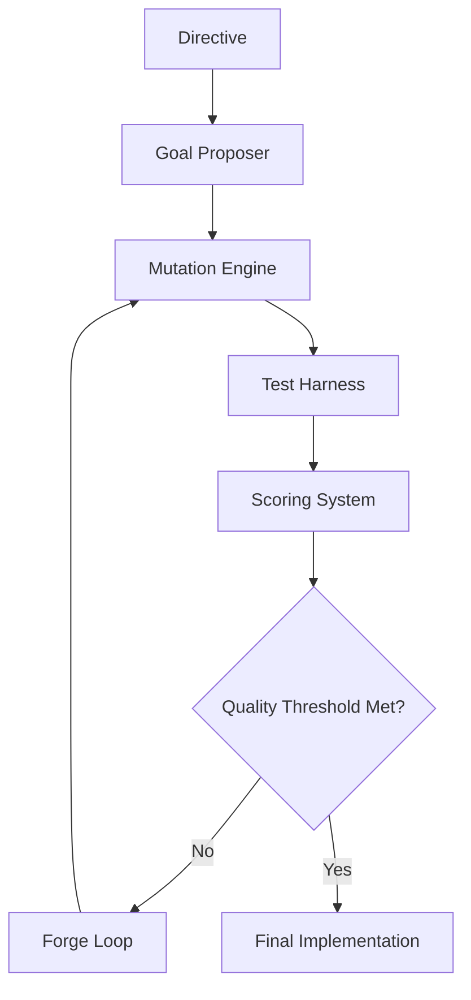

# Hephaestus

> Forge better code through continuous, autonomous improvement.

Hephaestus is an open-source framework that generates, tests, and improves code through an iterative, AI-driven process. Named after the Greek god of craftsmen and blacksmiths, Hephaestus embodies the spirit of forging and refining creations to perfection.

## Key Features

- **Directive-Driven Development**: Express what you need in a structured format, and let Hephaestus implement it
- **Autonomous Improvement Cycle**: Continuous refinement of code quality, performance, and functionality
- **Comprehensive Testing**: Automated test generation and execution to ensure correctness
- **Quality-Focused Scoring**: Multi-dimensional evaluation of code implementations
- **Modular Architecture**: Extensible components that can be customized or replaced
- **Language Agnostic**: Support for multiple programming languages and paradigms

## Getting Started

  

    

      <h3>Installation</h3>
    

    

      
Get Hephaestus up and running on your system

      <a href="guides/installation/" class="btn btn-primary">Installation Guide</a>
    

  

  
  

    

      <h3>Quick Start</h3>
    

    

      
Create your first project with Hephaestus

      <a href="guides/quickstart/" class="btn btn-primary">Quick Start Guide</a>
    

  

  
  

    

      <h3>Concepts</h3>
    

    

      
Learn the core concepts and architecture

      <a href="concepts/execution/" class="btn btn-primary">Concepts Guide</a>
    

  

## How Hephaestus Works

Hephaestus follows a continuous improvement cycle:

1. You provide a **Directive** specifying what you want to build
2. The **Goal Proposer** analyzes requirements and defines specific targets
3. The **Mutation Engine** generates or modifies code to meet these goals
4. The **Test Harness** evaluates the implementation against tests
5. The **Scoring System** assesses code quality across multiple dimensions
6. The **Forge Loop** decides whether to continue improving or accept the current implementation
7. This cycle repeats until quality thresholds are met

## Core Components

  

    

      <h3><a href="components/goal_proposer/">Goal Proposer</a></h3>
    

    

      
Strategic component that analyzes requirements and identifies improvement opportunities

    

  

  
  

    

      <h3><a href="components/mutation/">Mutation Engine</a></h3>
    

    

      
Code generation and transformation engine that implements identified goals

    

  

  

    

      <h3><a href="components/test_harness/">Test Harness</a></h3>
    

    

      
Testing framework that evaluates implementations against requirements

    

  

  

    

      <h3><a href="components/scoring/">Scoring System</a></h3>
    

    

      
Quality assessment system that evaluates code across multiple dimensions

    

  

  

    

      <h3><a href="components/forge_loop/">Forge Loop</a></h3>
    

    

      
Orchestration component that manages the iterative improvement process

    

  

  

    

      <h3><a href="components/registry/">Registry</a></h3>
    

    

      
Storage and versioning system for implementations and metadata

    

  

For a complete overview of all components, see the [Components Overview](components/).

## Guides

- [Running Tests](guides/test-run/): Learn how to run tests in Hephaestus
- [Configuration](reference/configuration/): Configure Hephaestus for your specific needs
- [Creating Directives](guides/directives/): Learn how to create effective directives
- [Extending Hephaestus](development/extending/): Add custom components and functionality

## Project Status

Hephaestus is under active development. For the latest updates and roadmap, see:

- [Project Roadmap](roadmap/): Planned features and development timeline
- [Project Status](project_status/): Current development status
- [GitHub Repository](https://github.com/yourusername/hephaestus): Source code and issue tracking

## Contributing

We welcome contributions from the community! See our [Contributing Guide](development/contributing/) to get started.

## Troubleshooting

Having issues? Check our [Troubleshooting Guide](about/troubleshooting/) for solutions to common problems.

## License

Hephaestus is released under the [MIT License](about/license/).
